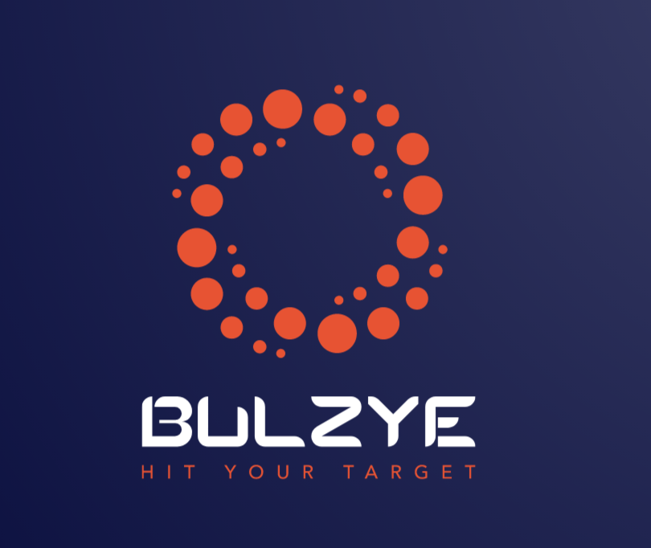

# Bulzye

**Digital money for the modern world**

Contributors: Alpa Sheladia, Aaron Galloway, Nathan Bratz, and Robert Leonhardt

###**Introduction** 
In this project, our team will create an account on out HTML page, request a public key for block chain ledger, request a service/product, provide a service/product, pay with Nano, and will receive Nano as a payment.

### What is Nano?
• Originally RaiBlocks, Nano is a trustless, fee-less, low latency
cryptocurrency that utilizes a novel block-lattice structure. Block-lattice is a
data-structure in which individual accounts control their own blockchain.
This allows blocks to be added quickly without conflict and sent to the
network for confirmation via Proof of Stake Voting.
• Since updates are inevitable to strengthen the network, the static nature of
the traditional whitepaper required too much effort to continually update &
publish. Therefore, Nano hosts its unique ‘Living Whitepaper’; managed
through the existing documentation website, making it easier to update/open
source.
• Protocol Design: Nano is decentralized & uses network-wide consensus to
validate transactions. Participating on the network requires following the
message & data designs – otherwise attempts at transacting will be ignored
& not properly confirmed by the network. 

### Node Implementation: Uses 2 algorithms
	Blake2b: Hashing, Blake2b is a fast, secure hash function that is a
modification of Blake algorithm. This cryptographic hash function is based
on ChaCha stream cipher; designed by Daniel J. Bernstein. Blake2b is one
of the algorithm based on Blake2 and the other one is Blake2s. The
difference between them is Blake2b is optimized for 64-bit platforms
whereas Blake2s is suitable for 8 to 32-bit platforms. Blake2 is faster and
more secure than MD5, SHA-1, 2 and SHA-3 hash algorithms.

	ED25519: Ed25519 signatures are elliptic-curve signatures, carefully
engineered at several levels of design and implementation to achieve very
high speeds without compromising security. Chosen for fast single signature
verification, faster batch verification, high security level, foolproof session
keys, collision resilience, no secret array indices or secret branch conditions,
small signatures(64byte)
